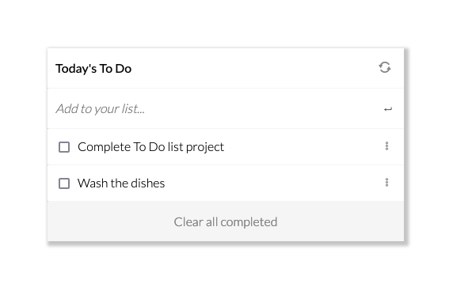

# To-Do-List

> This is my website for a To Do List

## Built With

- HTML & CSS & JS & WEBPACK

## Demo

- Online (https://sevinchek.github.io/to-do-list/)

## Project Setup

- Clone this repository (use this SSH key git@github.com:sevinchek/to-do-list.git)
- Open the folder project (to-do-list)
- Install all dependencies with "npm install"
- Run the project with "npm start" and the project will load automatically in your default browser

## Authors

👤 **Kevin**

- GitHub: [@sevinchek](https://github.com/sevinchek)
- Twitter: [@sevinchek](https://twitter.com/sevinchek)
- LinkedIn: [LinkedIn](https://linkedin.com/in/sevinchek)

## 🤝 Contributing

Contributions, issues, and feature requests are welcome!

## Show your support

Give a ⭐️ if you like this project
